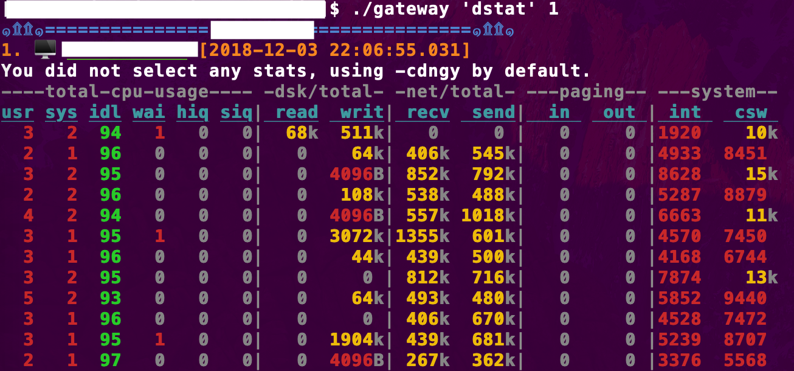

## 服务器日志查看，登录辅助工具

+ **已 cd 到日志目录。不需要输入长路径**
+ 不需要记忆/复制粘贴服务器地址
+ 避免来来回回登录不同项目不同服务器
+ 一条命令可顺序在多台服务器上执行，或者指定机器（序号或者地址）。
+ 可 ssh 到 第 n 台服务器

**命令包含空格，需要放到引号中''**

### 以某 gateway 服务为例,创建文件 gateway，并加执行权限，放在跳板机上：
    #!/bin/bash
    source  ./runner
    #declare -a hosts
    #填上服务器地址
    hosts=(gateway.1 gateway.2 gateway.3 gateway.4)
    #或者使用文件中的服务器地址,每行一个
    #readarray -t hosts < /cluster_path
    #调用, 包含日志所在目录
    runner hosts  "/path/to/logs" "$1" $2
  
### 列出服务器信息

    [user@server name]$ ./gateway info
    1.	gateway.1
    2.	gateway.2
    3.	gateway.3
    4.	gateway.4
    
### 在所有服务器上执行命令（可 Ctrl + c 终止后续）
    
    [user@server name]$ ./gateway date
    1. 🖥️  gateway.1 [2018-11-11 16:14:55.366]
    2018年 11月 11日 星期日 16:14:55 CST
    
    2. 🖥️  gateway.2 [2018-11-11 16:14:55.473]
    2018年 11月 11日 星期日 16:14:55 CST
    
    3. 🖥️  gateway.3 [2018-11-11 16:14:55.620]
    2018年 11月 11日 星期日 16:14:55 CST
    
    4. 🖥️  gateway.4 [2018-11-11 16:14:55.735]
    2018年 11月 11日 星期日 16:14:55 CST
    
### 在某一台服务器上执行命令，序号从1开始，可查看 ./gateway info 获取序号
    
    #通过序号, 且支持 top 等需要终端的命令
    [user@server name]$ ./gateway top 1
    
    #通过序号
    [user@server name]$ ./gateway 'date' 1
    1. 🖥️  gateway.1 [2018-11-11 16:18:40.158]
    2018年 11月 11日 星期日 16:18:40 CST
    
    #或者直接输入服务器地址
    [user@server name]$ ./gateway 'date' gateway.1
    1. 🖥️  gateway.1 [2018-11-11 18:40:19.912]
    2018年 11月 11日 星期日 18:40:20 CST

### 或者有需要，直接登录服务器（已 cd 到日志目录）
    #ssh 到第一台
    [user@server name]$ ./gateway ssh 1
    [user@server1 logs]$
    
